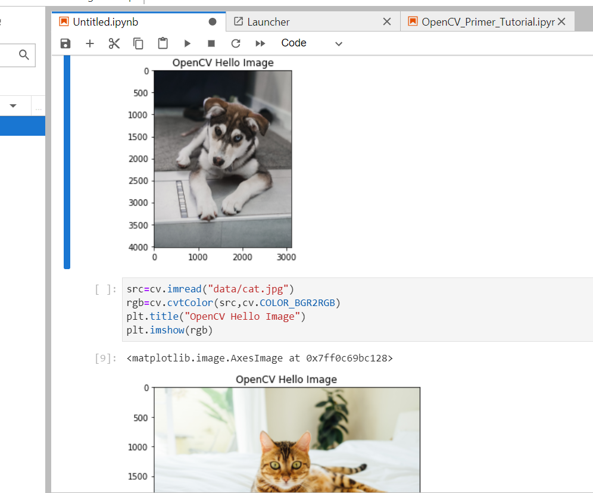

- [认识计算机视觉](#认识计算机视觉)
  - [计算机视觉发展历史](#计算机视觉发展历史)
  - [计算机视觉的主要任务](#计算机视觉的主要任务)
  - [计算机视觉应用场景](#计算机视觉应用场景)
- [计算机视觉框架](#计算机视觉框架)
- [OpenCV框架](#opencv框架)
- [图像读取与显示](#图像读取与显示)
  - [图像理解](#图像理解)
  - [图像读取与显示](#图像读取与显示-1)

# 认识计算机视觉

## 计算机视觉发展历史

## 计算机视觉的主要任务

## 计算机视觉应用场景

> 自动驾驶/辅助驾驶

> 机器视觉AI+机构/工业质检智能

> 安防监控-人脸识别/火灾监控/异常监控

> 其他更多行业

# 计算机视觉框架

>传统学习计算机视觉框架

>>SimpleCV

>>BoofCV

>>Dlib

>>JavaCV

>深度学习计算机视觉框架

>>Caffe

>>Tensorflow

>>Pytorch

>>Paddlepaddle

>>Keras

# OpenCV框架

>安装好opencv库后在intel网站初步试运行结果如下:

>>

# 图像读取与显示

## 图像理解

>灰色图像  单通道 

>彩色图像  三通道(blue green red) 

## 图像读取与显示

>imread函数 读取图像 

>imshow函数 显示图像 

>cv.waitKey(0) 表示一直等待(图像一直显示),直到任意一个键盘操作 

>cv.waitKey(1000) 表示等待一千毫秒，即一秒 

>cv.destroyAllWindows() 表示清除所有窗口 

