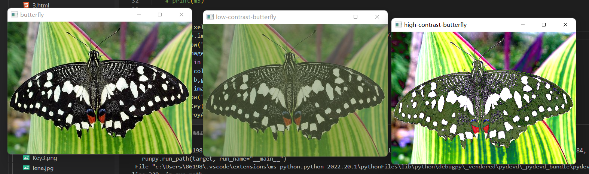
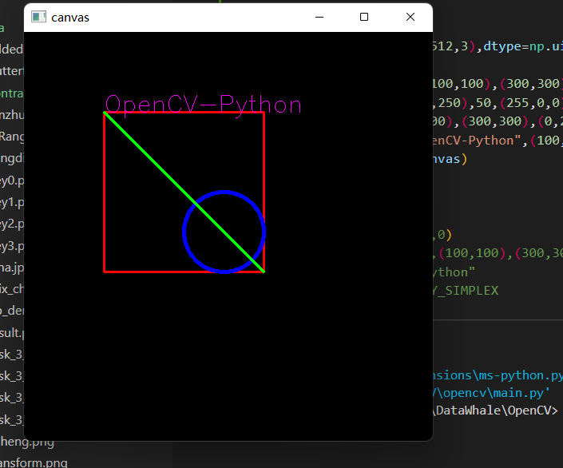
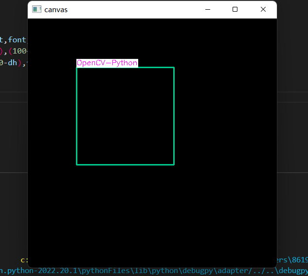
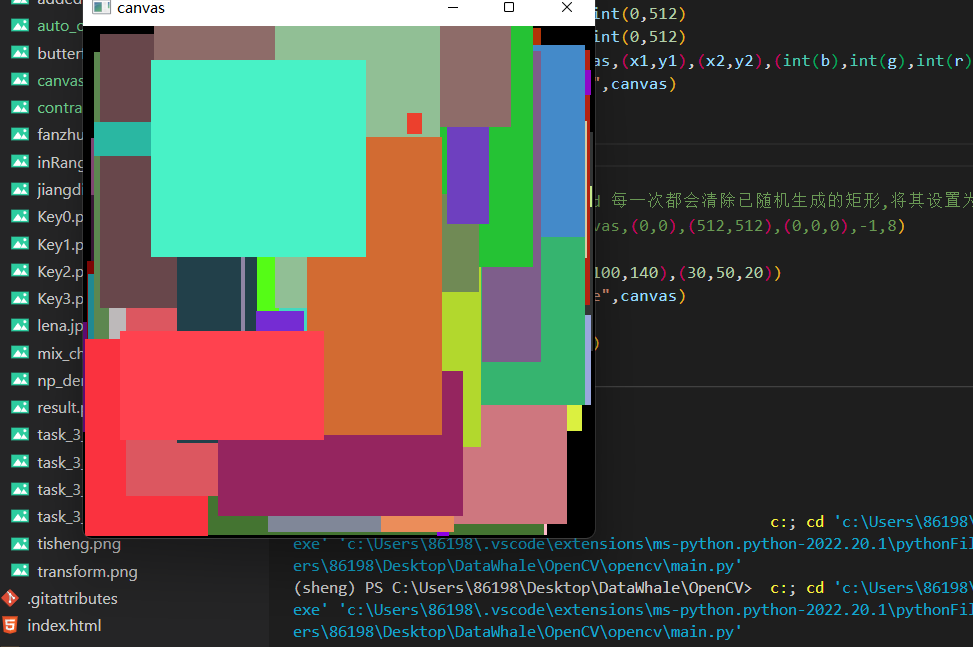
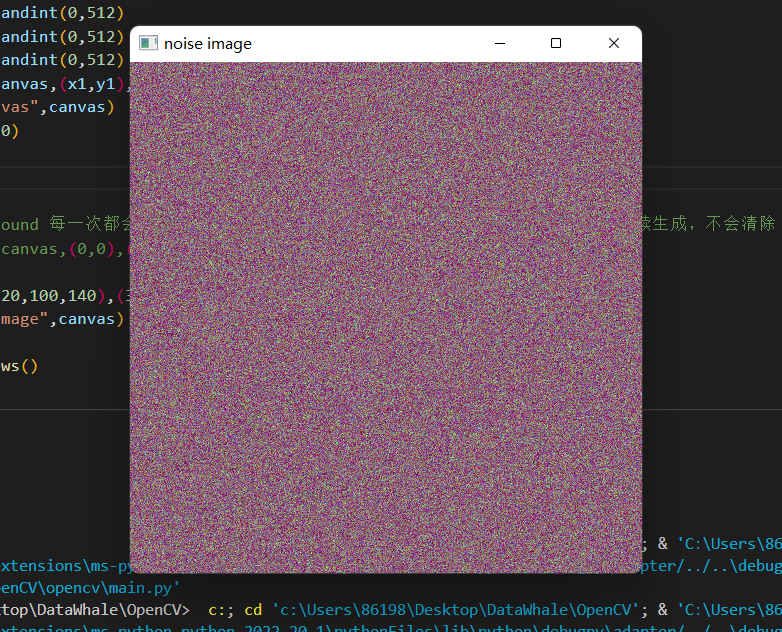
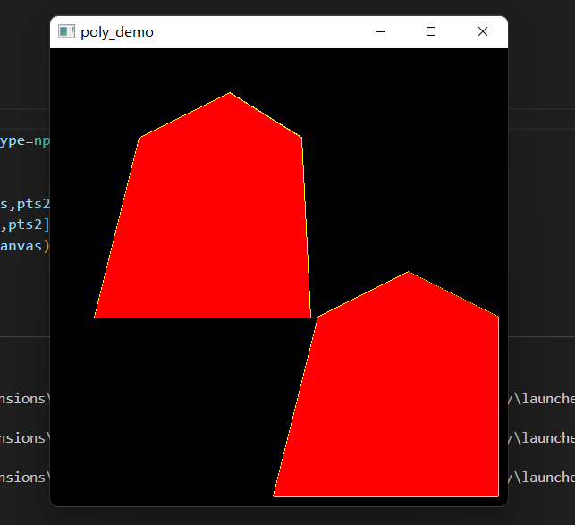

- [图像统计信息](#图像统计信息)
  - [OpenCV函数支持](#opencv函数支持)
  - [代码操作演示:](#代码操作演示)
- [图像几何形状绘制](#图像几何形状绘制)
  - [几何形状-函数](#几何形状-函数)
  - [文本绘制](#文本绘制)
  - [计算文本区域大小](#计算文本区域大小)
  - [代码操作演示](#代码操作演示-1)
- [随机数与随机颜色](#随机数与随机颜色)
  - [Python中的随机函数](#python中的随机函数)
  - [随机噪声图](#随机噪声图)
  - [代码操作演示](#代码操作演示-2)
- [多边形填充与绘制](#多边形填充与绘制)
  - [多边形绘制函数](#多边形绘制函数)
  - [点集支持](#点集支持)
  - [代码操作演示](#代码操作演示-3)

# 图像统计信息

## OpenCV函数支持

>* cv.mean(src[, mask]	) ->retval

>* cv.meanStdDev(src[, mean[, stddev[, mask]]]) ->mean, stddev

>* cv.minMaxLoc(src[, mask]) ->minVal, maxVal, minLoc, maxLoc

>* src表示输入图像,mask表示计算区域

>* mean, stddev, minVal, maxVal分别表示均值，标准方差，最小与最大  

## 代码操作演示:

# 图像几何形状绘制

## 几何形状-函数

>* 相关函数cv.line()、cv.circle()、cv.rectangle()、cv.ellipse()&nbsp;   椭圆cv.putText() 

>* 相关参数解释：

>>* img表示输入图像

>>* color表示颜色，如(255, 0,0)表示蓝色

>>* thickness表示线宽, 大于0表示绘制，小于0表示填充

>>* lineType表示渲染模式, 默认LINE_8, LINE_AA表示反锯齿

> * cv.rectangle(canvas,(100,100),(300,300),(0,0,255),2,8)  &nbsp;   矩形图像绘制

>> * canvas代表图像

>> * (100,100)与(300,300)代表左上右下坐标

>> * (0,0,255)代表颜色

>> * 2代表线条宽度(负数代表填充)

>> * 8是线性,默认取8

> * cv.circle(canvas,(250,250),50,(255,0,0),4,cv.LINE_8) &nbsp;   圆形图像绘制

>> * canvas代表图像

>> * (250,250)代表圆心坐标

>> * 50代表半径

>> * (255,0,0)代表颜色

>> * 4代表线条宽度(负数代表填充)

>> * cv.LINE_8是线条的类型。可以取8，4，CV_AA三个值,分别代表8邻接连接线，4邻接连接线和反锯齿连接线。默认值为8邻接

## 文本绘制

>* putText 默认只支持英文

>* org表示文字起始坐标点

>* fontFace表示字体类型

>* fontScale表示字体大小

## 计算文本区域大小

>函数计算文本区域大小函数

>>>*  (fw,uph),dh=cv.getTextSize(text,fontFace,font_scale,thickness)

>>>    text,  # 表示文本信息

>>>    fontFace, # 表示字体类型

>>>    fontScale, # 表示字体大小

>>>   thickness # 表示线宽

>>> 返回文本信息区域大小，与字体的基线baseline位置

## 代码操作演示

# 随机数与随机颜色

## Python中的随机函数

> Numpy中的随机函数

>> * random.randint(low, high=None, size=None, dtype=int) 

>> * Low表低值，high表示高值，size表示维度，dtype表示类型

>> * np.random.randint(0, 256)表示产生0~255随机数，类型是int

## 随机噪声图

> cv.randn(dst, mean, stddev)

>> * 生成目标图像dst

>> * 噪声均值mean

>> * 噪声方差stddev

>> * cv.randn(canvas, (40, 200, 140), (10, 50, 10))

## 代码操作演示

# 多边形填充与绘制

## 多边形绘制函数

>* 填充多边形

>> cv.fillPoly(img, pts, color[, lineType[, shift[, offset]]]) ->img

>* 绘制多边形

>> cv.polylines(img, pts, isClosed, color[, thickness[, lineType[, shift]]] ) ->img

>* pts表示一个或者多个点集

>* color表示颜色

>* thickness表示线宽，注意：必须大于0

>* lineType 表示渲染方式

## 点集支持

> pts表示一个或者多个点集

>* pts = []

>* pts.append((100, 100))

>* pts.append((200, 50))

>* pts.append((280, 100))

>* pts.append((290, 300))

>* pts.append((50, 300))

>* pts = np.asarray(pts, dtype=np.int32)

>* print(pts.shape)

>* 要求：必须是CV_32S, 对应np.int32

## 代码操作演示

