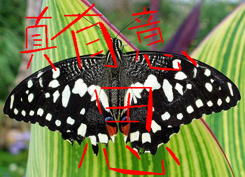
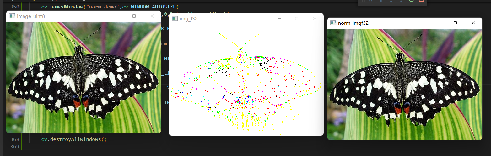
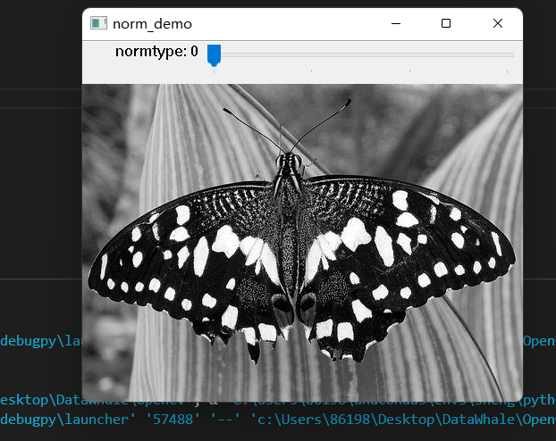
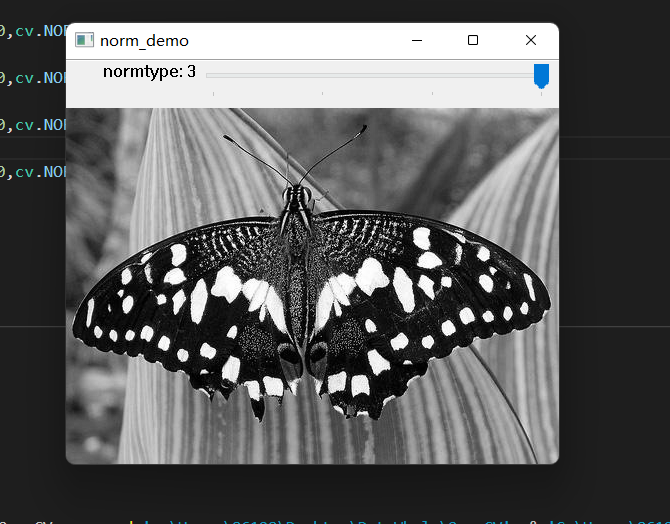
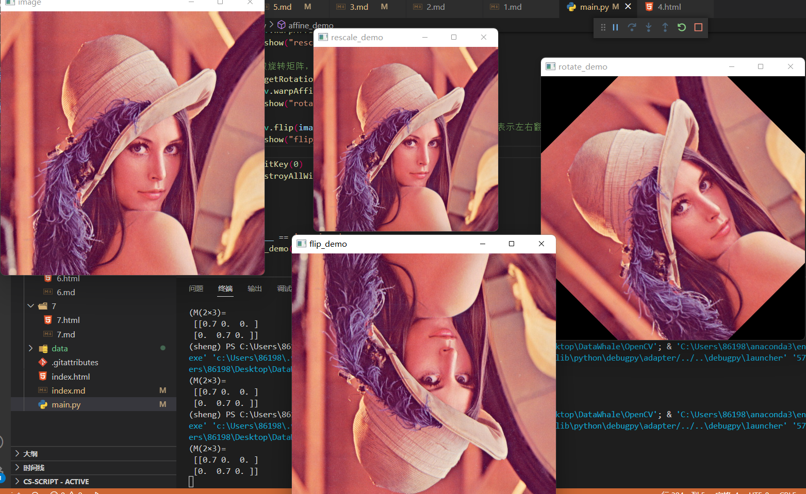
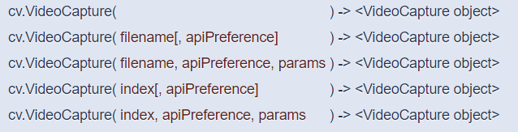
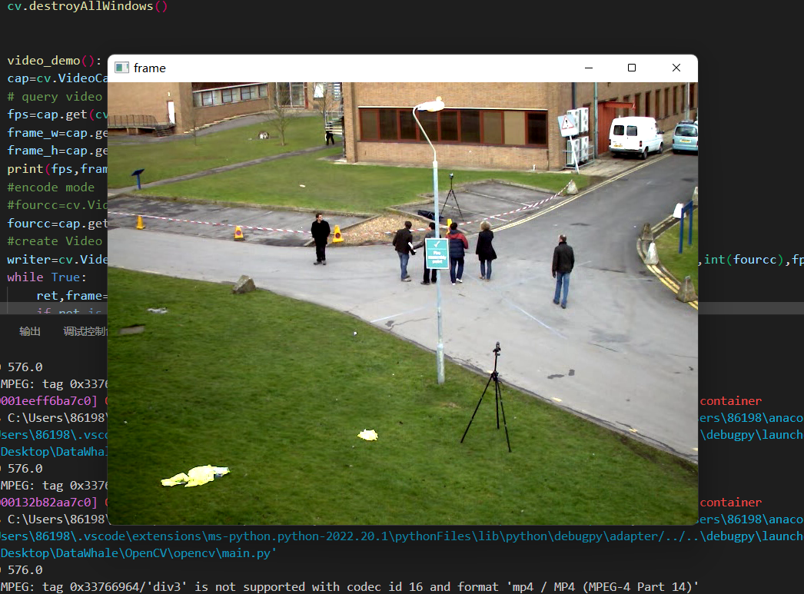

- [鼠标操作与响应](#鼠标操作与响应)
  - [鼠标事件与回调](#鼠标事件与回调)
  - [鼠标操作回调函数与其参数](#鼠标操作回调函数与其参数)
  - [代码操作演示](#代码操作演示)
- [图像像素类型转换与归一化](#图像像素类型转换与归一化)
  - [归一化函数](#归一化函数)
  - [数据转换](#数据转换)
  - [代码操作演示](#代码操作演示-1)
- [图像几何变换](#图像几何变换)
  - [几何变换支持函数](#几何变换支持函数)
  - [获得旋转矩阵](#获得旋转矩阵)
  - [翻转与特殊角度转换](#翻转与特殊角度转换)
  - [代码操作演示](#代码操作演示-2)
- [视频读写处理](#视频读写处理)
  - [视频标准与格式](#视频标准与格式)
  - [视频读取函数](#视频读取函数)
  - [查询视频属性](#查询视频属性)
  - [视频文件保存](#视频文件保存)
  - [代码操作演示](#代码操作演示-3)

# 鼠标操作与响应

## 鼠标事件与回调

> * EVENT_LBUTTONDOWN #鼠标左键按下

> * EVENT_MOUSEMOVE  #鼠标移动

> * EVENT_LBUTTONUP  #鼠标左键弹起

> * 其他相关鼠标按键事件可去查

## 鼠标操作回调函数与其参数

> * def mouse_drawing(event,x,y,flags,Userdata):

>> * int event, int x, int y, int flags, void *userdata

>> * event表示鼠标事件

>> * (x, y)表示当前鼠标位置

>> * flags表示鼠标状态

>> * Userdata表示回调用户数据，可以为空

## 代码操作演示

> 下面是用鼠标绘制直线，不清除已绘制的直线

>> 

# 图像像素类型转换与归一化

## 归一化函数

> cv.normalize(	src, dst[, alpha[, beta[, norm_type[, dtype[, mask]]]]]	) -> dst

>> * src表示输入图像, dst表示输出图像

>> * alpha, beta 默认是1， 0，是归一化的区间值

>> * norm_type默认是NORM_L2, 

>> * norm_type常用是NORM_MINMAX

## 数据转换

> * Imread读入默认是uint8, 转换为float32,通过imshow显示之前，必须归一化到[0~1]之间

## 代码操作演示

# 图像几何变换

## 几何变换支持函数

> cv.warpAffine(src, M, dsize[, dst[, flags[, borderMode[, borderValue]]]]	) -> dst

>> * src表示输入图像

>> * M 表示2x3变换矩阵

>> * dsize表示目标图像dst的大小

>> * 支持平移变换、放缩变换、旋转变换

## 获得旋转矩阵

> 旋转矩阵获取cv.getRotationMatrix2D

>> * Center表示旋转中心

>> * angle表示度数，大于零表示逆时针旋转

>> * scale表示放缩尺度大

## 翻转与特殊角度转换

> * cv.flip(src, flipCode[, dst]	) ->dst

> * cv.rotate(src, rotateCode[, dst]	) -> dst

>> * src表示输入图像

>> * flipCode支持0水平、1垂直，-1对角线翻转，

>> * rotateCode只支持旋转90°，180°，270°

## 代码操作演示

# 视频读写处理

## 视频标准与格式

## 视频读取函数

> 

>> * filename表示视频文件

>> * Index表示USB摄像头或者web camera的索引

>> * apiPreference = CAP_ANY意思自动决定第三方视频库如： cv.CAP_FFMPEG， cv.CAP_DSHOW

## 查询视频属性

> * VideoCaput的get方法:   (....).get(以下参数)

> * cv.CAP_PROP_FRAME_WIDT  #宽

> * cv.CAP_PROP_FRAME_HEIGHT  #高

> * cv.CAP_PROP_FPS #帧率

> * cv.CAP_PROP_FOURCC  #编码格式

> * cv.CAP_PROP_FRAME_COUNT

## 视频文件保存

> cv.VideoWriter( 

> * filename, 保存文件名称

> * fourcc, 编码方式

> * fps,  帧率

> * frameSize 视频帧大小,必须与实现大小相符

> * [, isColor]	) ->	<VideoWriter object>

## 代码操作演示

