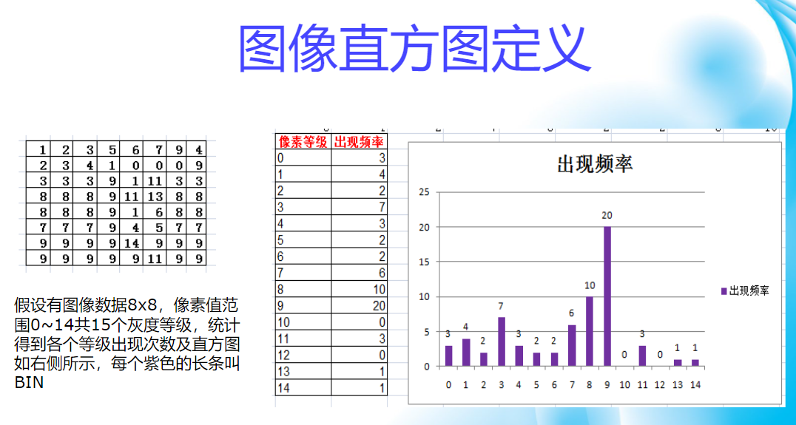
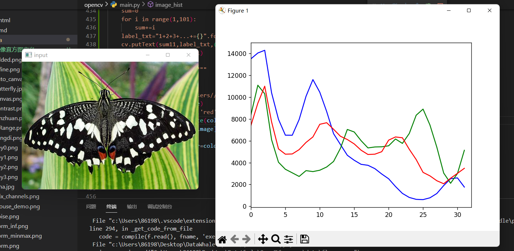
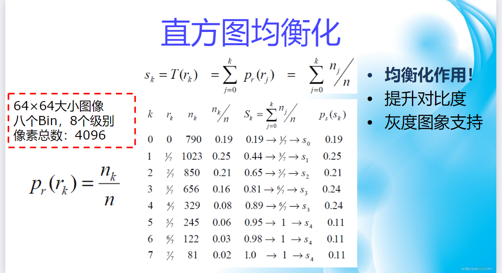
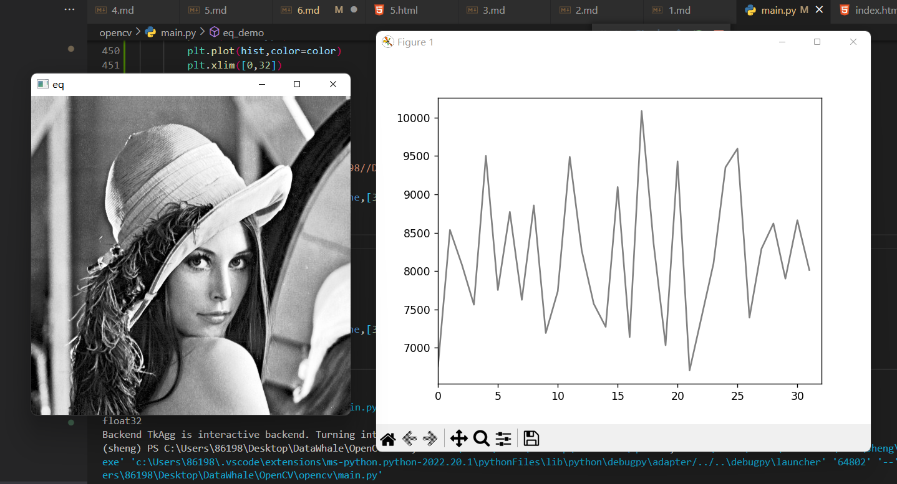
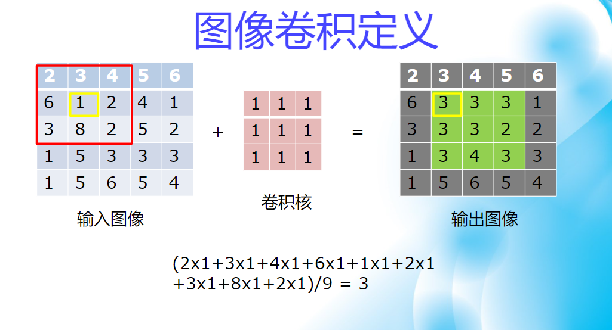
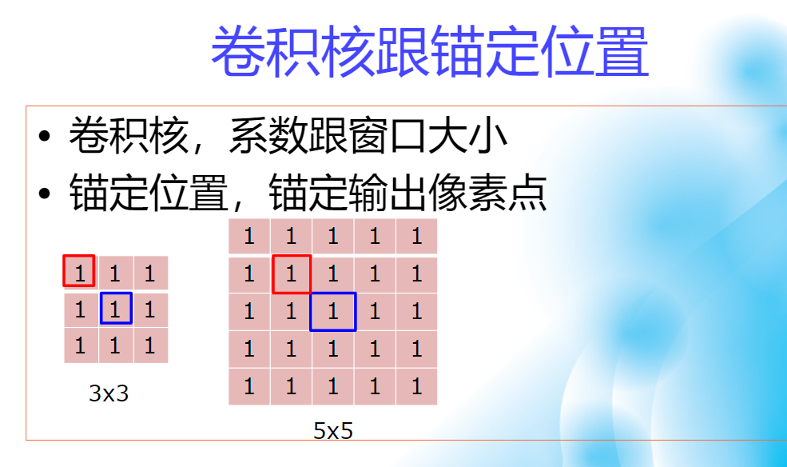
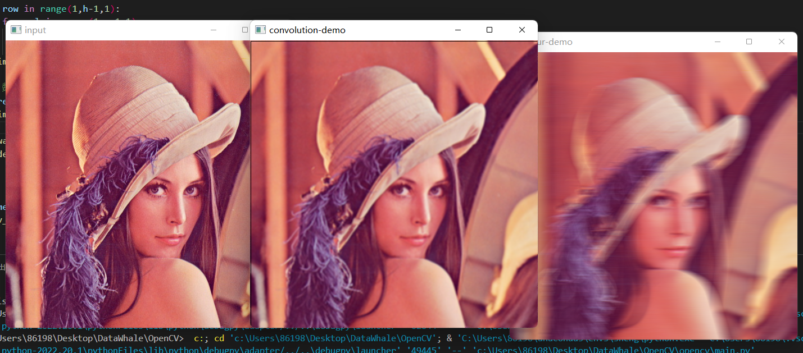
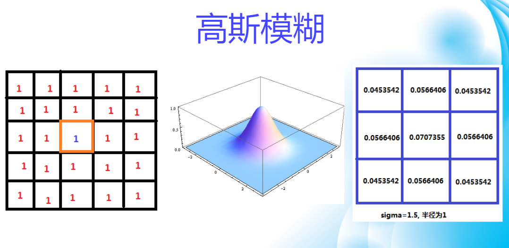
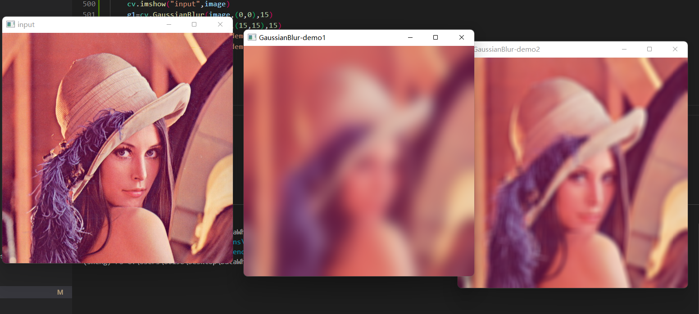

- [图像直方图](#图像直方图)
  - [图像直方图定义](#图像直方图定义)
  - [直方图函数](#直方图函数)
  - [代码演练](#代码演练)
- [图像直方图均衡化](#图像直方图均衡化)
  - [直方图均衡化](#直方图均衡化)
  - [直方图均衡化函数](#直方图均衡化函数)
  - [代码演练](#代码演练-1)
- [图像卷积操作](#图像卷积操作)
  - [图像卷积定义](#图像卷积定义)
    - [卷积的边缘填充](#卷积的边缘填充)
  - [卷积函数](#卷积函数)
  - [代码演练](#代码演练-2)
- [高斯模糊](#高斯模糊)
  - [高斯模糊](#高斯模糊-1)
  - [函数解释](#函数解释)
  - [代码演练](#代码演练-3)

# 图像直方图

## 图像直方图定义

## 直方图函数

> * calcHist(images, channels, mask, histSize, ranges[, hist[, accumulate]]) -> hist

>> * images表示图像

>> * channels表示通道

>> * mask 默认None

>> * histSzie表示bin的个数

>> * ranges表示通道的取值范围

>>> * hist = cv.calcHist([image], [i], None, [32], [0, 256])

## 代码演练

# 图像直方图均衡化

## 直方图均衡化

* 必须是灰度图像！！！

## 直方图均衡化函数

> * cv.equalizeHist(src[, dst]) -> dst

>> * src必须是八位单通道图像

>> * dst返回结果图像，类型与src保持一致

## 代码演练

# 图像卷积操作

## 图像卷积定义

> 各点各自相乘后求平均值后的值，是该卷积核对应矩阵中心点的值，从左往右，从上往下各卷积一遍，卷积结果是中心都得到卷积，但边缘并没办法进行卷积操作

### 卷积的边缘填充

> * 边缘处理，边缘填充的方式

>> * cv.BORDER_DEFAULT gfedcb|abcdefgh|gfedcba

>> * cv.BORDER_WRAP cdefgh|abcdefgh|abcdefg

>> * cv.BORDER_CONSTANT iiiiii|abcdefgh|iiiiiii

## 卷积函数

> * cv.blur(	src, ksize[, dst[, anchor[, borderType]]]) ->	dst

>> * src表示输入图像 CV_8U, CV_32F or CV_64F

>> * Ksize卷积核大小

>> * anchor锚定位置(anchor=(-1,-1)代表锚点位置在卷积核中心)

>> * borderType边缘处理方式

>>> * blured=cv.blur(image,(5,5))

## 代码演练

# 高斯模糊

## 高斯模糊

> * 简单来说，高斯模糊就是卷积核系数权重不同，越靠近中间系数越大

## 函数解释

> * cv.GaussianBlur(src, ksize, sigmaX[, dst[, sigmaY[, borderType]]]) ->dst

>> * ksize必须是正数而且是奇数

>> * sigmaX高斯核函数X方向标准方差

>> * sigmaY高斯核函数Y方向标准方差,默认0

>> * 表示跟sigmaX相同，

>> * ksize为0表示从sigmaX计算生成ksize，

>> * ksize大于0表示从ksize计算生成sigmaX，

## 代码演练

